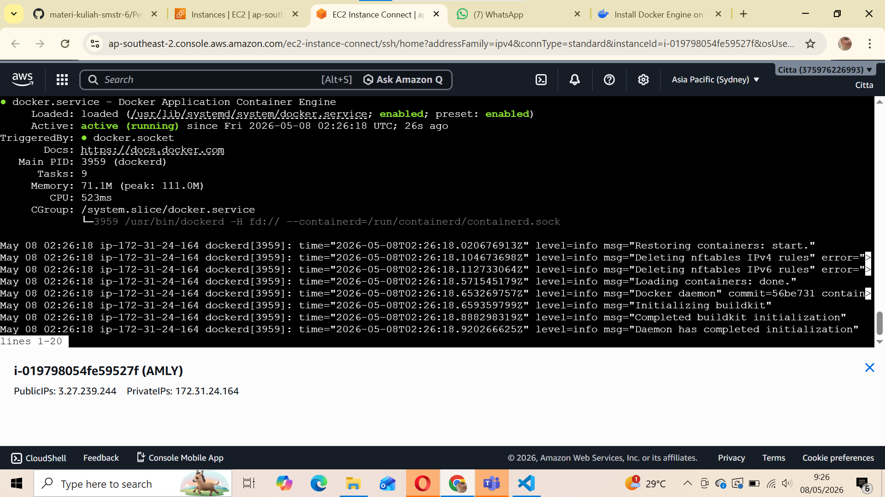
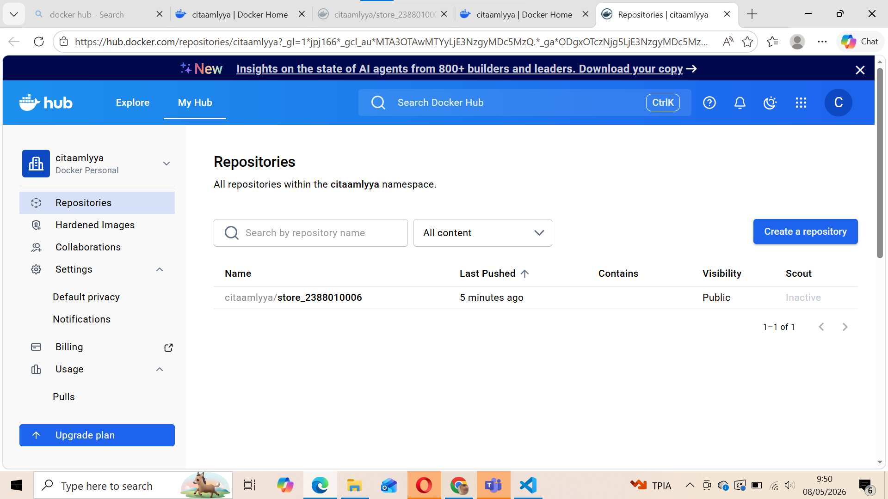
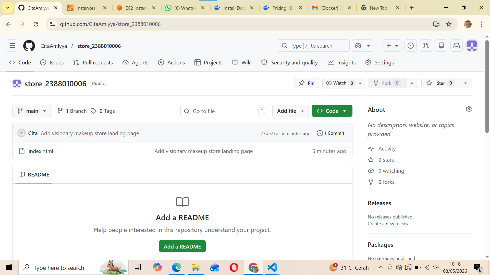
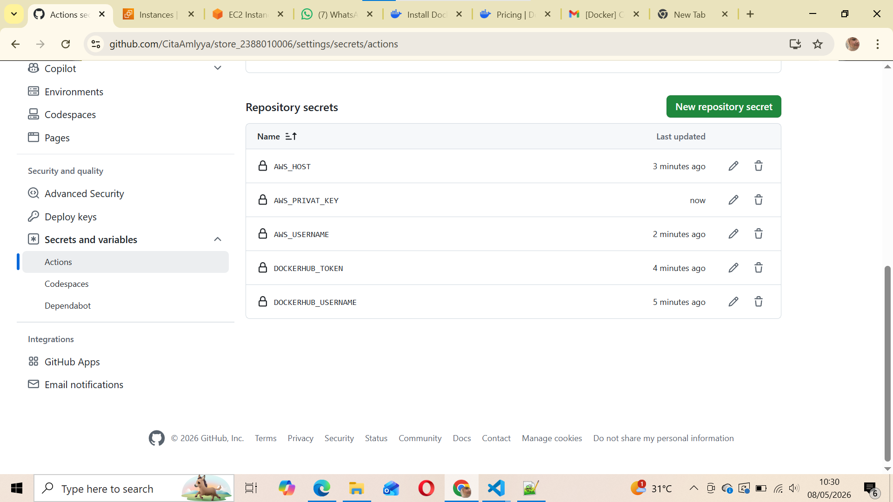
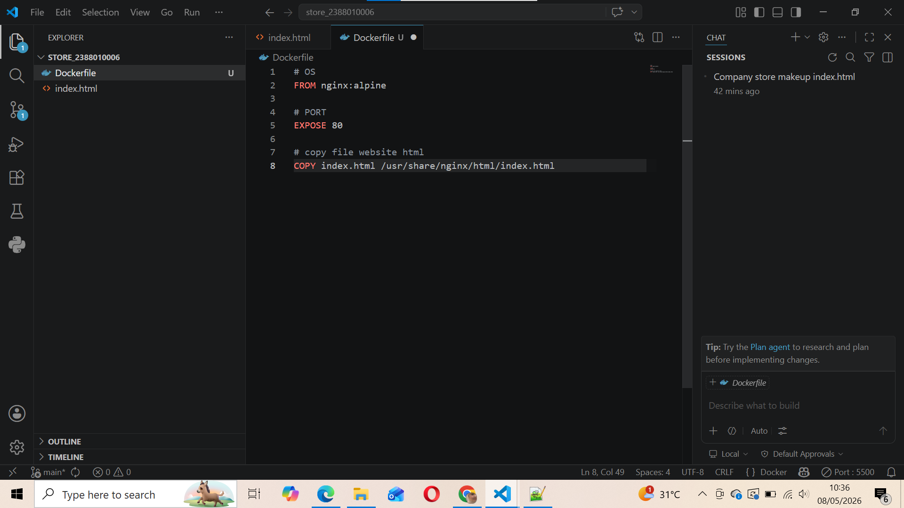
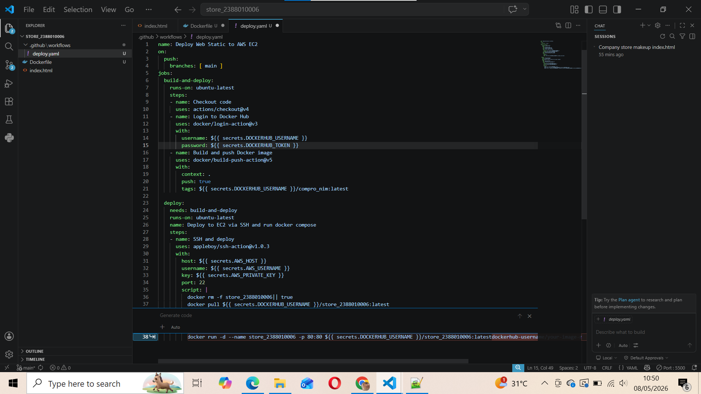
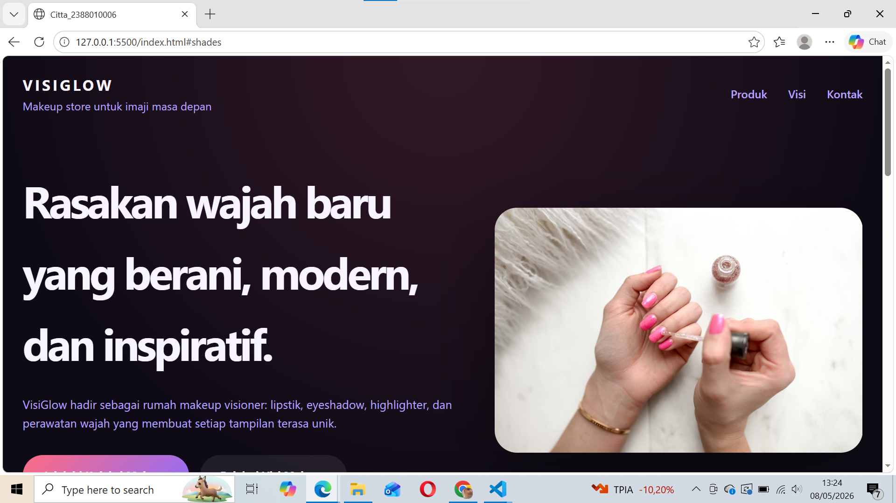

# CI/CD dengan Git -> Github Actions -> Docker hub _> EC2 Aws

1. Start Instance di Aws EC2
2. paching OS -> sudo apt update && sudo apt Upgrade
3. Install Docker di EC2 AWS https://docs.docker.com/engine/install/ubuntu/

- Uninstall Docker old version (sudo apt remove $(dpkg --get-selections docker.io docker-compose docker-compose-v2 docker-doc podman-docker containerd runc | cut -f1))
- Set up Apt Docker
- Install Docker Engine
- Cek Docker -> systemctl status docker
https://hub.docker.com/

4. Create Gudang / Repo di Docker Hub https://hub.docker.com/
- Create akun dan login
- create repo -> (hub->repo->New)
- Create Tokens ( Klik Profile->Account Setting ->Security ->Access Tokens -> Generate new token)
- Simpan token jangan sampai hilang

5. Create Repo di Github
- Membuat Repo baru dengan nama himafor_nim
- BUat projek di Local
- Push ke Github

6. Set Up Github Secret Variables
- mKlik Repo -> Settings -> Secrets and variables -> Actions -> New repository secret
- buat secret "DOCKERHUB_USERNAME" with your Docker Hub username
- buat secret "DOCKERHUB_TOKEN" with your Docker Hub token
- AWS_USERNAME isi username EC2 AWS kamu (ubuntu)
- AWS_PRIVATE_KEY isi private key
- AWS_HOST isi public IP EC2 AWS kamu

7. Membuat Resep lingkungan Pengembangan (Dockerfile)
- Buat file Dockerfile di folder project kamu (misal Pertemuan9/Compro)
- Untuk Next.js dengan output standalone, isi Dockerfile dengan kode berikut:

FROM node:18-alpine AS base

# Install dependencies only when needed
FROM base AS deps
RUN apk add --no-cache libc6-compat
WORKDIR /app

COPY package.json package-lock.json* ./
RUN npm ci

# Rebuild the source code only when needed
FROM base AS builder
WORKDIR /app
COPY --from=deps /app/node_modules ./node_modules
COPY . .

RUN npm run build

# Production image, copy all the files and run next
FROM base AS runner
WORKDIR /app

ENV NODE_ENV production

RUN addgroup --system --gid 1001 nodejs
RUN adduser --system --gid 1001 nextjs

COPY --from=builder /app/public ./public

# Set the correct permission for prerender cache
RUN mkdir .next
RUN chown nextjs:nodejs .next

# Automatically leverage output traces to reduce image size
# https://nextjs.org/docs/advanced-features/output-file-tracing
COPY --from=builder --chown=nextjs:nodejs /app/.next/standalone ./
COPY --from=builder --chown=nextjs:nodejs /app/.next/static ./.next/static

USER nextjs

EXPOSE 3000

ENV PORT 3000

CMD ["node", "server.js"]

8. Membuat CI/CD Workflow (Github Actions) di Repositori Github
- Buat folder .github/workflows/ di root repo
- Buat File deploy.yml di folder .github/workflows/
- Isi deploy.yml dengan kode berikut:

name: CI/CD Compro

on:
  push:
    branches:
      - main

jobs:
  build-and-deploy:
    runs-on: ubuntu-latest

    steps:
    - name: Checkout code
      uses: actions/checkout@v4

    - name: Set up Node.js
      uses: actions/setup-node@v4
      with:
        node-version: '18'

    - name: Install dependencies
      working-directory: Pertemuan9/Compro
      run: npm install

    - name: Build
      working-directory: Pertemuan9/Compro
      run: npm run build

    - name: Login to Docker Hub
      uses: docker/login-action@v3
      with:
        username: ${{ secrets.DOCKERHUB_USERNAME }}
        password: ${{ secrets.DOCKERHUB_TOKEN }}

    - name: Build and push Docker image
      uses: docker/build-push-action@v5
      with:
        context: Pertemuan9/Compro
        push: true
        tags: ${{ secrets.DOCKERHUB_USERNAME }}/compro:latest

    - name: Deploy to EC2
      uses: appleboy/ssh-action@v1
      with:
        host: ${{ secrets.AWS_HOST }}
        username: ${{ secrets.AWS_USERNAME }}
        key: ${{ secrets.AWS_PRIVATE_KEY }}
        script: |
          docker pull ${{ secrets.DOCKERHUB_USERNAME }}/compro:latest
          docker stop compo || true
          docker rm compo || true
          docker run -d -p 80:3000 --name compo ${{ secrets.DOCKERHUB_USERNAME }}/compro:latest

9. Pastikan semua tidak ada konflik termasuk permission
- Stop dan disable nginx -> sudo systemctl stop nginx
- sudo systemctl disable nginx
- add ubuntu to docker group -> sudo usermod -aG docker ubuntu
- commit dan push -> dan cek di website
