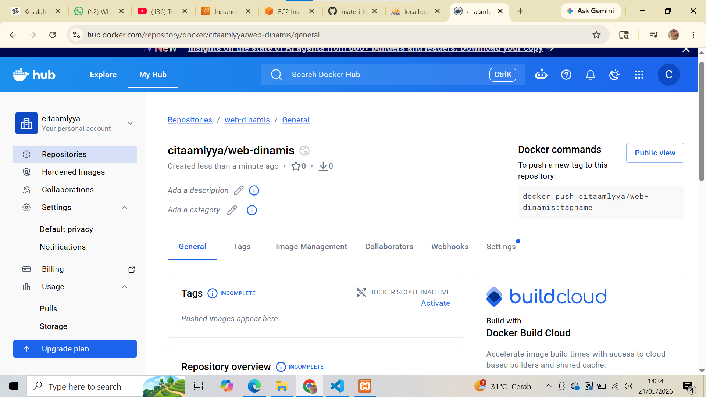
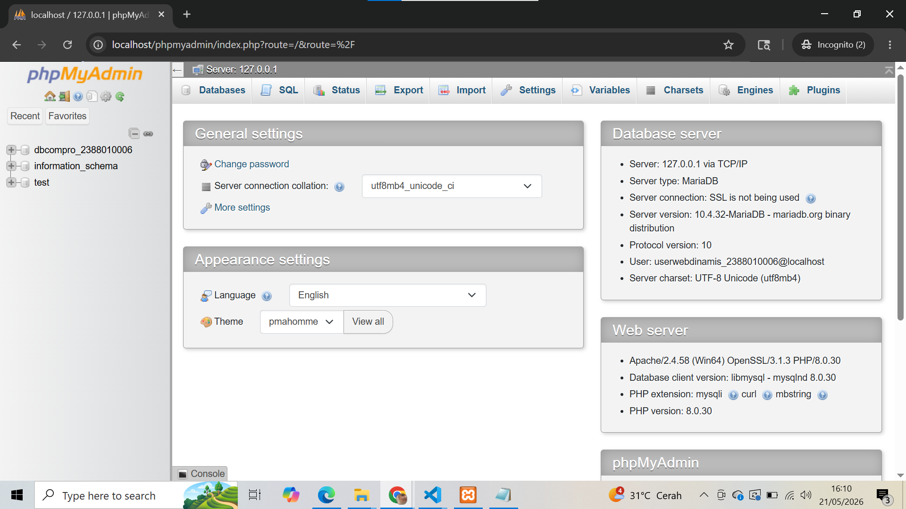
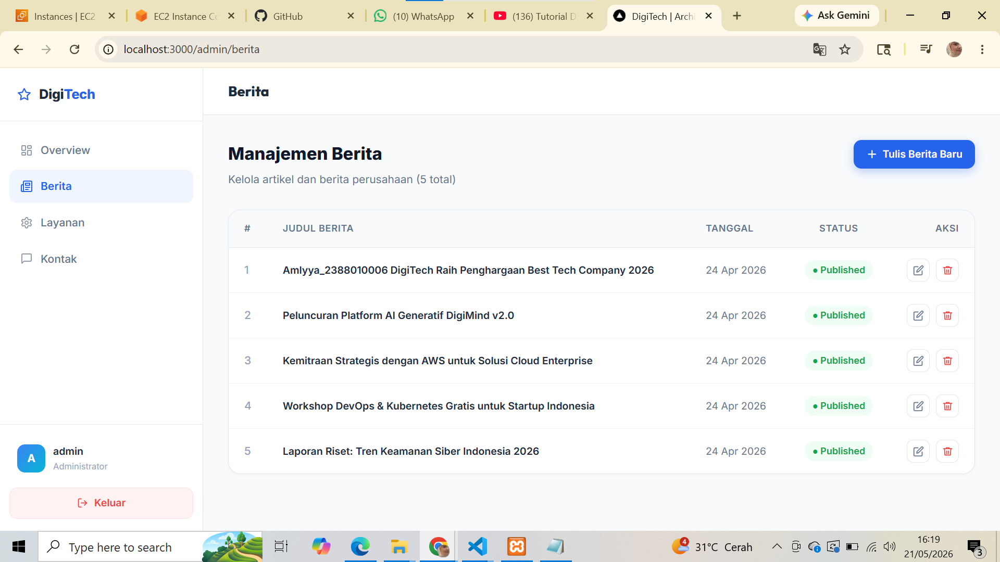

# Deploy multiple Container Menggunakan Compos

1. Start Instance EC2 di AWS 
2. paching 05
3. Uninstall semua Services manual  sebelumnya
4. Repositori baru untuk web dinamis di docker hub

5. Buka projek company store_2388010006
6. Bagi 2 folder untuk projek web App statis dan Dinamis
7. Move file index dan docker milik web statis ke folder web-status
8. Copy Folder projek Next.js (pertemuan9) Folder Web-dinamis
9. Lakukan Testing di local projek Next.js
- Install Dependencies: npm install
- Create user di DBMS : sudo mysql -u root -p
  - CREATE USER 'userwebdinamis_2388010006'@'localhost' IDENTIFIED BY 'DpH)BZ76VPg.ggz4';
  - GRANT ALL PRIVILEGES ON *.* TO 'userwebdinamis_nim'@'localhost';
  - FLUSH PRIVILEGES;
  - exit;

- Edit File .env di folder web-dinamis
- npm run build
- npm start
- Pastikan web dapat diakses di http://localhost:3000 admin tanpa error

10. Buat file Dockerfile
11. Buat file docker-compose.yml
12. Buat Workflows File -> deploy-dinamis.yml di folder .github/workflows/ dari Projek web-dinamis
13. Edit File -> deploy.yml di folder .github/workflows/ untuk
14. Update Host AWS di Github
15. Commit Changes ke GitHub dari lokal
16. Push Changes ke GitHub
17. Cek di Github, apakah actions jalan dan berhasil

