# UAS: Deploy Web Static dan Docker di EC2

1. Membuat EC2 Instance

   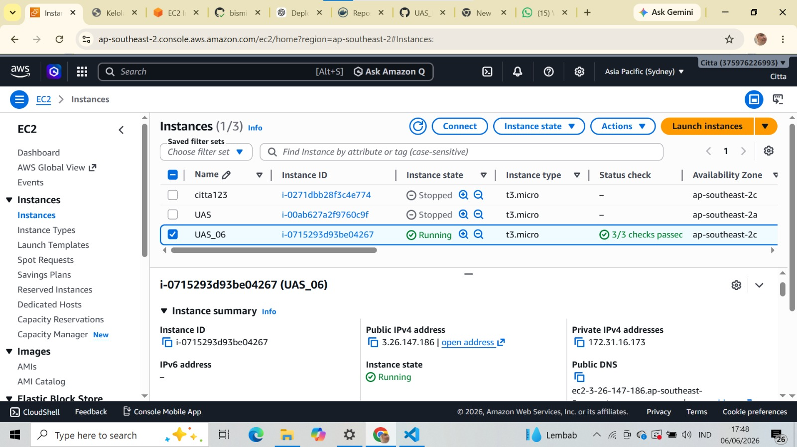
   - Menyiapkan instance baru di AWS EC2 untuk menjalankan aplikasi.

2. Membuat Folder Project

   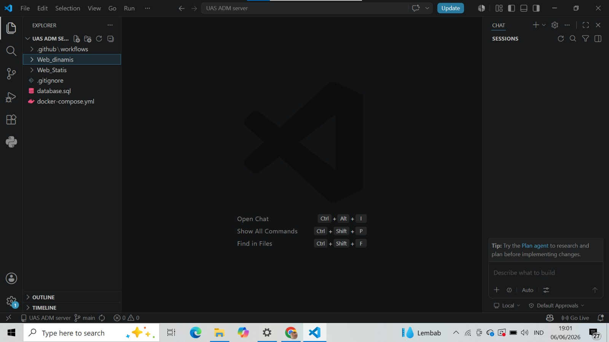
   - Membuat struktur folder proyek untuk menyimpan sumber daya dan file aplikasi.

3. Memindahkan project web static UTS ke dalam folder `stati-web`

   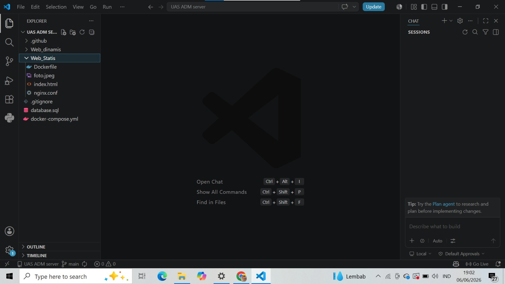
   - Menyalin dan mengatur ulang file web static ke folder proyek yang benar.

4. Membuat `dashboard.php`

   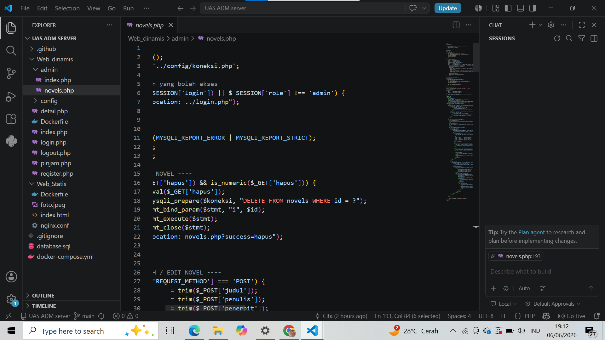
   - Membuat halaman dashboard sederhana untuk menampilkan data atau kontrol aplikasi.

5. Menginstal Docker dan Docker Compose pada EC2

   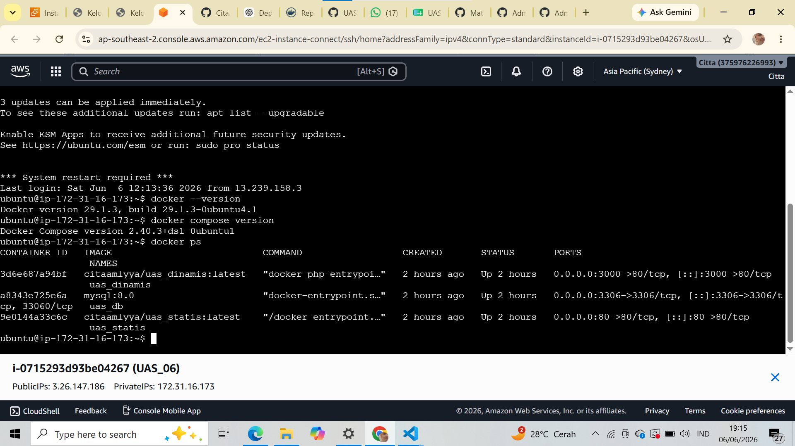
   - Mengonfigurasi lingkungan Docker pada instance EC2 untuk menjalankan kontainer.

6. Menambahkan GitHub Secrets

   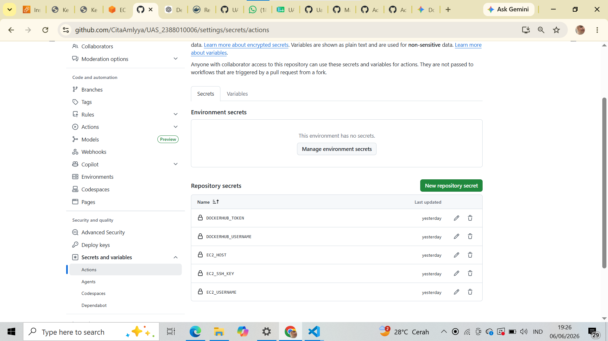
   - Menyimpan kredensial dan variabel lingkungan yang dibutuhkan untuk proses CI/CD.

7. Build dan Push Docker Image Otomatis

   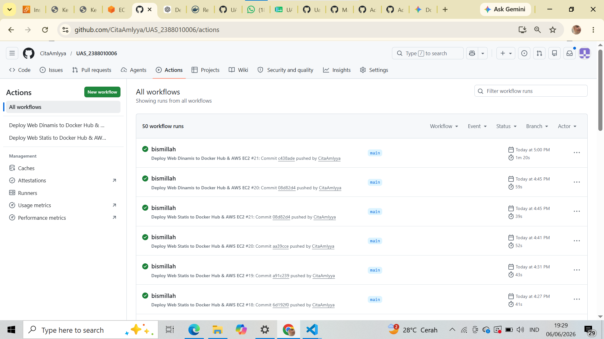
   - Menjalankan pipeline untuk membangun image Docker dan mengirimkannya ke registry.

8. Menampilkan Halaman Web Dinamis

   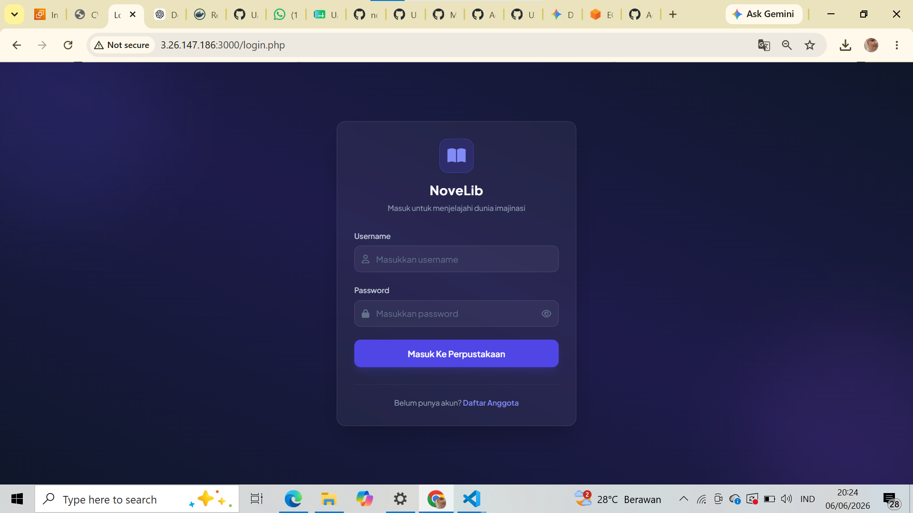
   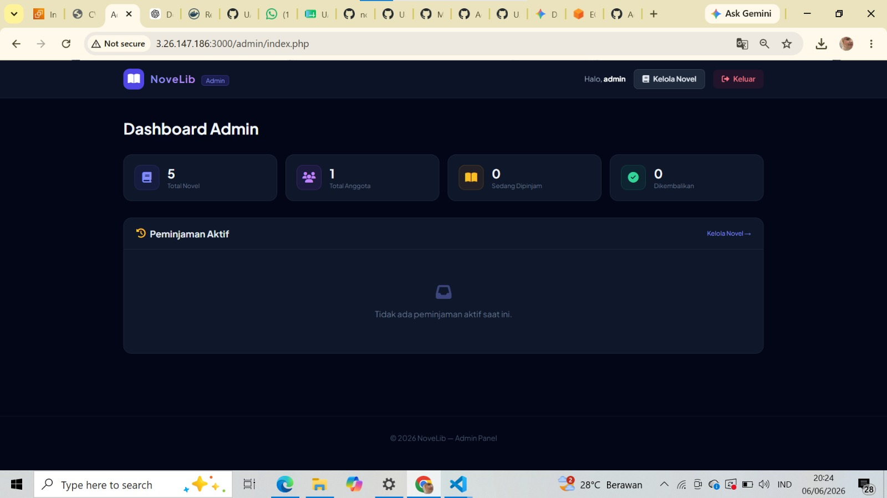
   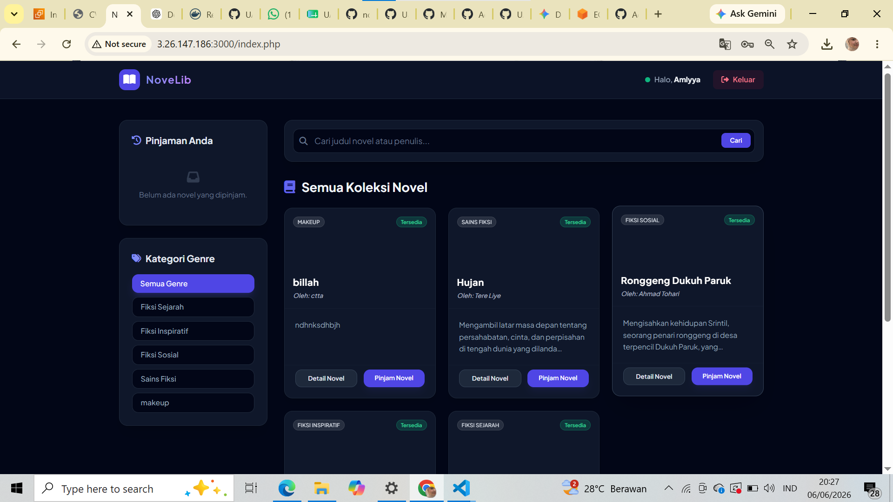

9. Tampilan Web Statis

   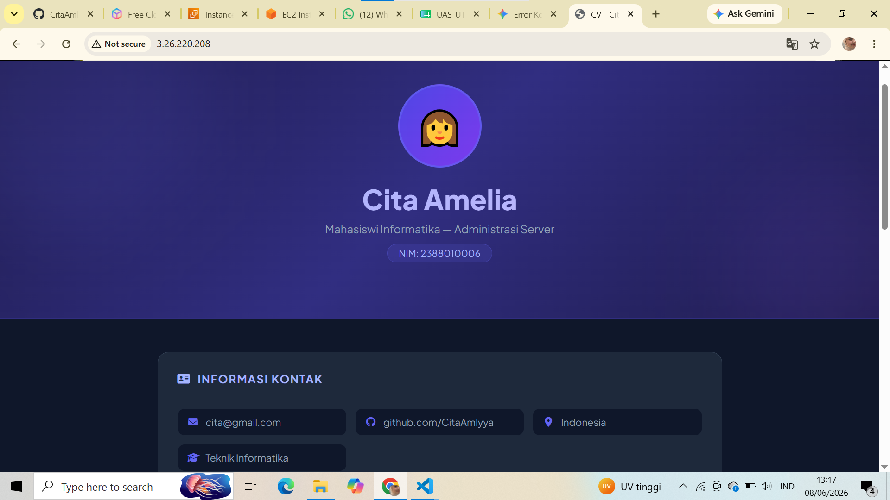
